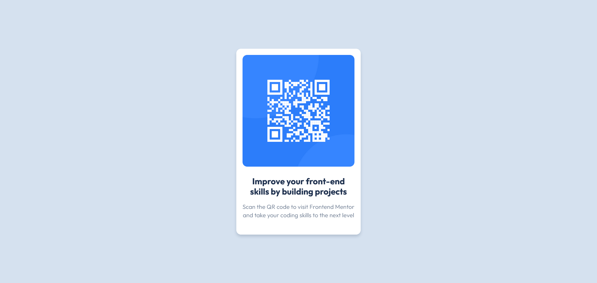

# Frontend Mentor - QR code component solution

This is a solution to the [QR code component challenge on Frontend Mentor](https://www.frontendmentor.io/challenges/qr-code-component-iux_sIO_H). Frontend Mentor challenges help you improve your coding skills by building realistic projects.

## Table of contents

- [Overview](#overview)
  - [Screenshot](#screenshot)
  - [Links](#links)
- [My process](#my-process)
  - [Built with](#built-with)
  - [What I learned](#what-i-learned)
  - [Continued development](#continued-development)
- [Author](#author)

## Overview

### Screenshot



### Links

- Live site URL: [Github pages link](https://conquerant2135.github.io/qr-code-challenge/)
- Solution URL : [Github repository link](https://github.com/Conquerant2135/qr-code-challenge)

## My process

### Built with

- Semantic HTML5 markup
- CSS custom properties
- Flexbox
- [fonts](https://fonts.google.com/specimen/Outfit)

### What I learned

I learned that I can import font by link .

```html
<link rel="preconnect" href="https://fonts.googleapis.com" />
<link rel="preconnect" href="https://fonts.gstatic.com" crossorigin />
<link
  href="https://fonts.googleapis.com/css2?family=Outfit:wght@100..900&display=swap"
  rel="stylesheet"
/>
```

### Continued development

- spacement , padding , margin management
- responsive layout

## Author

- Frontend Mentor - [@Conquerant2135](https://www.frontendmentor.io/profile/Conquerant2135)
- Github - [@Conquerant2135](https://github.com/Conquerant2135)
